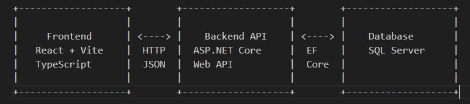
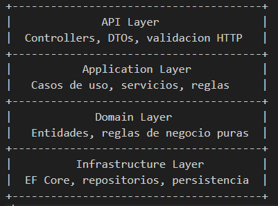

04 — Architecture Overview
Industrial Traceability System (ITS)
Estado: Borrador inicial
Version: 0.1.0
Documento previo: docs/03-domain-model.md

1. Proposito de este documento

Este documento define la arquitectura de alto nivel del sistema: como se organiza, como se comunican sus partes y que decisiones se toman desde el inicio.

No incluye:
codigo
clases concretas
carpetas definitivas
nombres de endpoints
esquema de base de datos
componentes de UI

Esos temas vienen en etapas posteriores.
El objetivo aqui es tener un mapa claro antes de empezar a construir.

2. Vista general

El sistema se compone de tres bloques principales:

Frontend: aplicacion web SPA que consume la API.
Backend: API REST que contiene la logica de negocio y el acceso a datos.
Database: almacenamiento relacional de la informacion.

La comunicacion entre frontend y backend es por HTTP con JSON. La comunicacion entre backend y base de datos es a traves de Entity Framework Core.

3. Decisiones de arquitectura

Cada decision se documenta con su justificacion. El objetivo no es usar el patron mas moderno, sino el mas adecuado para el alcance y para que el autor pueda explicarlo en una entrevista.

3.1 Monolito modular en el backend

Decision: el backend sera un monolito modular, no microservicios.

Justificacion:
El alcance del proyecto no justifica microservicios.
Un monolito es mas facil de ejecutar, entender y desplegar localmente.
La modularidad interna permite separar responsabilidades sin la complejidad operativa de los microservicios.
Es un estilo que se defiende bien en entrevistas: se sabe cuando NO usarlo.

Alternativa descartada: microservicios. Se descarta por sobreingenieria para este alcance.

3.2 API REST

Decision: el backend expone una API REST.
Justificacion:
Es el estilo mas comun en aplicaciones empresariales con ASP.NET Core.
Es facil de consumir desde React.
Permite documentar con Swagger / OpenAPI.

No se necesita GraphQL ni gRPC para este dominio.
Alternativa descartada: GraphQL. Se descarta porque agrega complejidad sin un problema real que resolver en este alcance

3.3 Separacion en capas dentro del backend

Decision: el backend se organiza en capas con responsabilidades claras.

Capas conceptuales:

Justificacion:

Separa responsabilidades de forma clara.
Permite testear la logica de negocio sin depender de la base de datos ni del HTTP.
Es un estilo conocido y defendible.
No se necesita Clean Architecture completa ni DDD tactico completo; se toma lo util sin sobrecargar.

Alternativa descartada: Clean Architecture completa con multiples proyectos. Se descarta porque agrega estructura sin aportar valor proporcional al alcance.

3.4 Entity Framework Core como ORM

Decision: usar EF Core para el acceso a datos.
Justificacion:
Integracion nativa con ASP.NET Core.
Permite trabajar con migraciones versionadas.
Es el ORM estandar del stack elegido.
Facilita testing con proveedores en memoria o base de datos de prueba.

Alternativa descartada: Dapper puro. Se descarta porque el dominio no exige control manual del SQL en esta etapa. Podria reconsiderarse en reportes puntuales.

3.5 SQL Server como base de datos

Decision: usar SQL Server como motor de base de datos.
Justificacion:
Es parte del stack propuesto en el overview.
Es comun en entornos empresariales.
Se integra bien con EF Core.
Permite practicar SQL real, indices y consultas.

Alternativa descartada: PostgreSQL. No se descarta por razones tecnicas, sino por coherencia con el stack declarado. Podria cambiarse si surge una razon concreta.

3.6 Frontend SPA con React + Vite + TypeScript
Decision: el frontend sera una SPA construida con React, Vite y TypeScript.

Justificacion:
Es un stack moderno y comun en portafolios.
Vite simplifica el desarrollo y el build.
TypeScript aporta tipado y reduce errores.
React es ampliamente usado en aplicaciones empresariales.

Alternativa descartada: Next.js. Se descarta porque el proyecto no requiere SSR ni rutas del lado del servidor en esta etapa.

3.7 Comunicacion frontend-backend

Decision: el frontend consume la API REST por HTTP con JSON.

Justificacion:
Es el enfoque mas simple y comun.
Permite separar completamente frontend y backend.
Facilita probar la API con Swagger, Postman o curl.
Consideraciones:
Se manejara autenticacion con JWT en el header Authorization.
Los errores se manejaran con codigos HTTP y respuestas JSON consistentes.

3.8 Autenticacion con JWT

Decision: autenticacion basada en JWT.
Justificacion:
Es un mecanismo stateless y comun en APIs REST.
Se integra bien con ASP.NET Core.
Permite demostrar manejo de roles y autorizacion.
Consideraciones:
Los tokens se emiten tras autenticacion exitosa.
Los permisos se verifican por rol en el backend.
El detalle se define en la etapa de autenticacion.

3.9 Testing

Decision: pruebas automatizadas en las partes que aporten valor.
Justificacion:
No se busca cobertura total, sino pruebas utiles.
Se prioriza testear reglas de negocio y casos de uso criticos.
Se usara xUnit para el backend.
Consideraciones:
No se testeara UI en la primera version.
No se perseguira cobertura del 100%.

3.10 Documentacion

Decision: la documentacion es parte del entregable, no un extra.
Justificacion:
El repositorio debe mostrar el proceso, no solo el resultado.
Los documentos en docs/ explican decisiones y contexto.
Esto es parte del valor del portafolio.

4. Estructura general del repositorio

Estructura propuesta a alto nivel:

IndustrialTraceabilitySystem/

├── README.md
│
├── docs/
│ ├── 01-project-overview.md
│ ├── 02-requirements.md
│ ├── 03-domain-model.md
│ └── 04-architecture-overview.md
│
├── src/
│ ├── backend/
│ └── frontend/
│
├── database/
│
├── tests/
│
└── .gitignore

Nota: la estructura interna de backend, frontend y tests se definira en la etapa de setup del proyecto.

5. Flujo de una peticion

Ejemplo conceptual de como viaja una peticion:

Usuario
|
v
Frontend (React)
|
| HTTP + JSON + JWT
v
API (ASP.NET Core)
|
| Validacion + Autorizacion
v
Application Layer
|
| Reglas de negocio
v
Domain Layer
|
| Entidades
v
Infrastructure (EF Core)
|
| SQL
v
SQL Server

6. Que NO se incluye en esta arquitectura

Para dejar claro el alcance:
No microservicios.
No mensajeria asincrona (colas, bus de eventos).
No cache distribuida.
No contenedores obligatorios (Docker puede agregarse despues si aporta valor).
No CI/CD avanzado en la primera version.
No infraestructura cloud.
No observabilidad avanzada (tracing, metricas distribuidas).
No integracion con equipos industriales reales.

Todo esto podria reconsiderarse si el proyecto lo justifica mas adelante.

7. Riesgos y decisiones abiertas

Tema Riesgo Decision actual
Tamano del backend Sobrecargar capas Mantener 4 capas simples, sin proyectos extra
Dominio Reglas demasiado complejas Mantener reglas claras y explicables
Frontend Sobrecomplicar el estado global Usar estado local y hooks, sin Redux en v1
Auth Complejidad innecesaria JWT simple con roles, sin refresh tokens en v1
Testing Perseguir cobertura total Testear solo lo que aporta valor
Base de datos Migraciones mal gestionadas Versionar migraciones desde el inicio
Estas decisiones podran revisarse en etapas posteriores.
